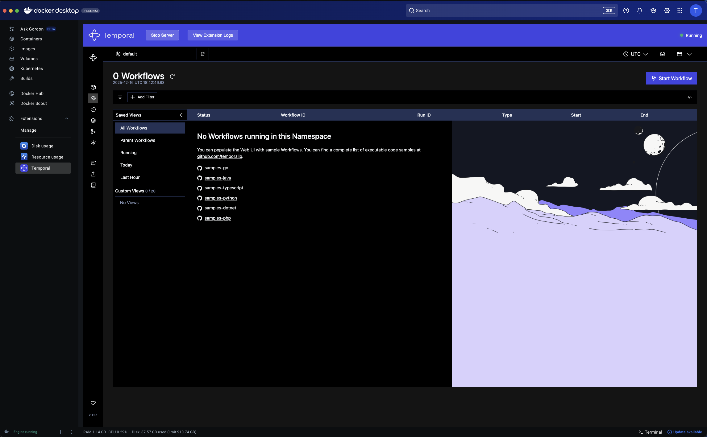

# Temporal Docker Desktop Extension



Docker Desktop extension for running Temporal Server locally with persistent SQLite storage.

## What This Provides

- One-click Temporal Server start/stop
- Embedded Temporal Web UI in Docker Desktop
- SQLite persistence via Docker volume
- Minimal setup - no external dependencies

## Prerequisites

- Docker Desktop 4.8.0 or later
- Extensions feature enabled in Docker Desktop

## Installation

```bash
make install
```

Or manually:

```bash
docker build -t temporal-extension:latest .
docker extension install temporal-extension:latest
```

## Usage

1. Open Docker Desktop
2. Click "Temporal" in the left sidebar
3. Click "Start Server" button
4. Wait ~3 seconds for server to start
5. Temporal Web UI loads automatically in docker or at localhost:8233

## Data Persistence

Workflow data persists in Docker volume `temporal-dev-data`. Data survives:
- Container restarts
- Extension updates
- Docker Desktop restarts

To clear all data:

```bash
docker volume rm temporal-dev-data
```

## Technical Details

Uses Temporal CLI dev server with:
- SQLite backend (`--db-filename /data/temporal.db`)
- Listen on all interfaces (`--ip 0.0.0.0`)
- Single container deployment
- Health checks via `temporal operator cluster health`
